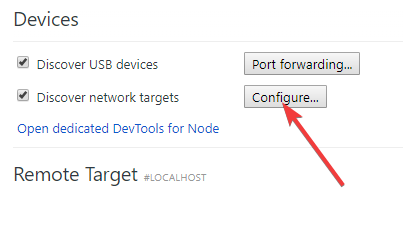

Title: Debug your IOS device browser on Windows
Published: 1/8/2019
Tags: Mobile
---

## Setting up to remotely debug your IOS(phone/tablet) from Windows

You'll need the awesome [remotedebug-ios-webkit-adapter](https://github.com/RemoteDebug/remotedebug-ios-webkit-adapter). Follow the install instructions.
Requires [scoop](https://github.com/lukesampson/scoop).

Then when you get to the debugging using the Chrome dev tools, make sure you add the `localhost:9000` to the network targets list.

Also note that both Itunes and the phone seem to keep requesting confirmation that the link is **trusted**.

